# Scalablytyped Converter - Comprehensive Architectural Analysis

## 1. Codebase Overview

**Scalablytyped** is a sophisticated Scala tool that converts TypeScript definition files (`.d.ts`) into Scala.js type definitions. The project enables Scala.js developers to use JavaScript libraries with full type safety by automatically generating Scala bindings from TypeScript definitions.

### Repository Structure

The codebase is organized into several key modules using Mill as the build tool:

- **`core`** - Fundamental data structures, utilities, and type definitions
- **`logging`** - Logging infrastructure and utilities  
- **`ts`** - TypeScript AST representation and parsing logic
- **`scalajs`** - Scala.js AST representation and code generation
- **`phases`** - Pipeline framework for multi-stage processing
- **`importer-portable`** - Core conversion logic and phases
- **`importer`** - Full importer with CI/CD capabilities
- **`cli`** - Command-line interfaces for different use cases
- **`runtime`** - Scala.js runtime components

## 2. Architecture Analysis

### High-Level System Architecture

The system follows a **multi-phase pipeline architecture** where TypeScript definitions are progressively transformed through several stages:

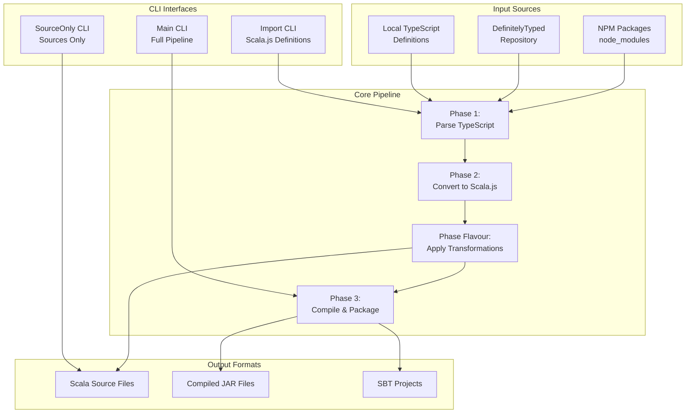

### Module Dependencies

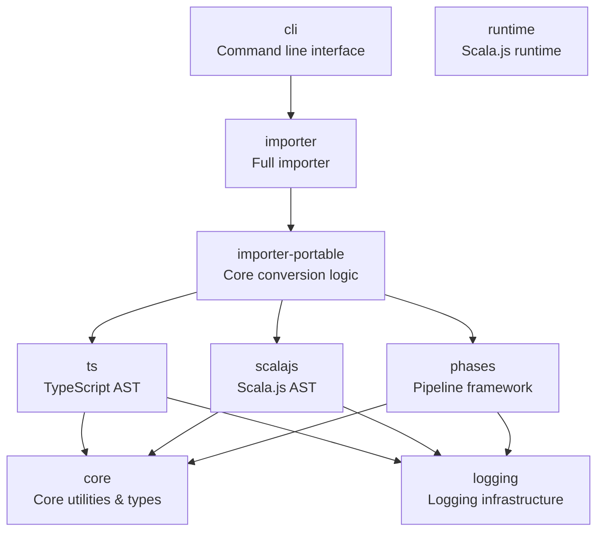

### Key Design Patterns

1. **Pipeline Pattern**: The core architecture uses a multi-phase pipeline (`RecPhase`) that processes libraries through sequential transformation stages
2. **Visitor Pattern**: Extensive use of tree transformations via visitor patterns for both TypeScript and Scala.js ASTs
3. **Immutable Data Structures**: Heavy use of immutable collections (`IArray`) and case classes
4. **Functional Programming**: Monadic error handling with `PhaseRes` and functional composition
5. **Dependency Injection**: Configurable components through constructor injection

## 3. Data Flow and Processing Pipeline

### Main Data Flow

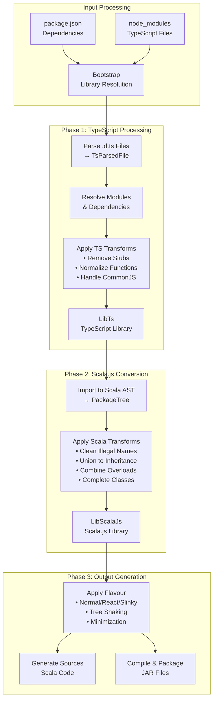

### Core Data Structures

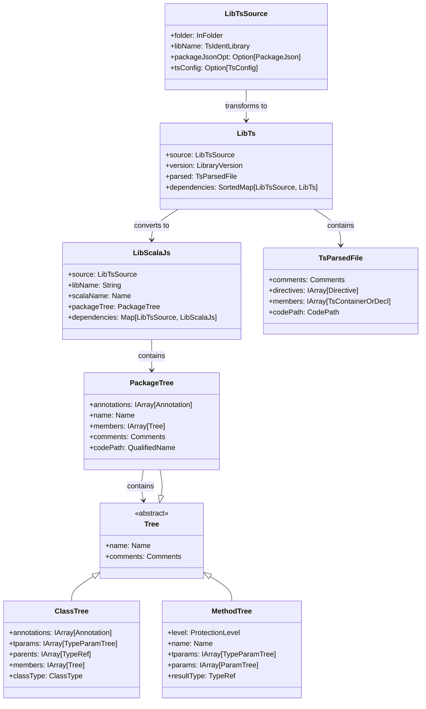

## 4. Entry Points and Execution Paths

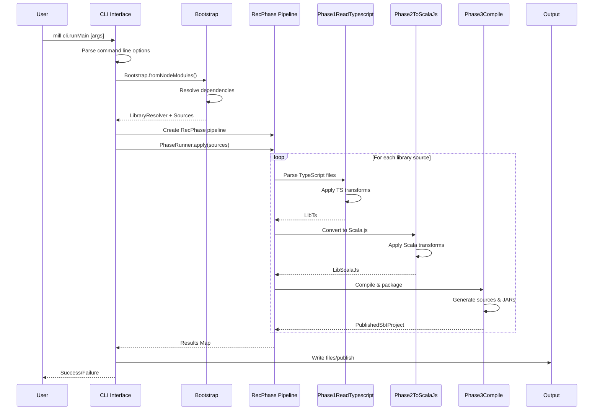

## 5. Technical Details by Component

### Core Module (`core`)
**Primary Responsibilities:**
- Provides fundamental data structures and utilities used across all modules
- Defines immutable collections (`IArray`) and core type definitions
- Handles JSON parsing, file operations, and string utilities

**Key Classes:**
- `IArray[T]` - Immutable array implementation for performance and safety
- `Name` - Type-safe wrapper for Scala identifiers with escaping
- `QualifiedName` - Represents fully qualified type names
- `Comments` - Handles documentation and comment preservation

### TypeScript Module (`ts`)
**Primary Responsibilities:**
- Represents TypeScript AST as immutable Scala case classes
- Provides parsing and tree transformation capabilities
- Handles TypeScript-specific concepts (modules, namespaces, type mappings)

**Key Classes:**
- `TsParsedFile` - Root of TypeScript AST representing a parsed `.d.ts` file
- `TsTreeScope` - Manages symbol resolution and lookup within TypeScript trees
- `TsType` hierarchy - Represents all TypeScript type constructs
- `TreeTransformation` - Visitor pattern for AST transformations

### Scala.js Module (`scalajs`)
**Primary Responsibilities:**
- Represents Scala.js AST and code generation
- Handles Scala.js-specific annotations and constraints
- Provides different "flavours" for various React frameworks

**Key Classes:**
- `PackageTree` - Root container for generated Scala code
- `ClassTree`, `MethodTree`, `FieldTree` - Scala language constructs
- `TreeScope` - Symbol resolution for Scala AST
- `FlavourImpl` - Strategy pattern for different output styles

### Phases Module (`phases`)
**Primary Responsibilities:**
- Implements the pipeline framework for multi-stage processing
- Handles dependency resolution between processing phases
- Provides error handling and progress tracking

**Key Classes:**
- `RecPhase[Id, T]` - Recursive phase definition with dependency tracking
- `PhaseRunner` - Executes phases with proper dependency ordering
- `PhaseRes[Id, T]` - Monadic result type for error handling

## 6. Transformation Pipeline Details

### Phase Processing State Machine

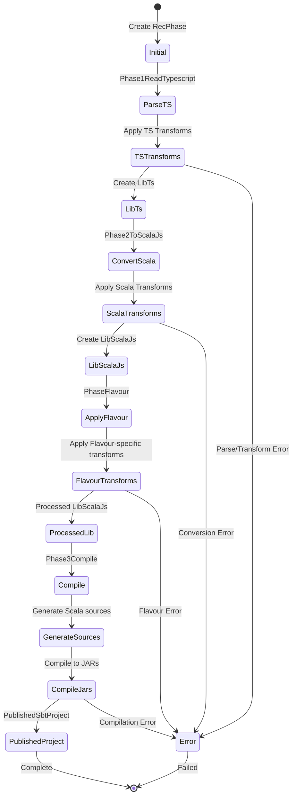

### TypeScript Transformation Pipeline

```mermaid
flowchart TD
    subgraph "TypeScript Transformations (Phase 1)"
        TS1[Library-Specific Transforms]
        TS2[Set JS Location]
        TS3[Simplify Parents]
        TS4[Remove Stubs]
        TS5[Infer Types from Expressions]
        TS6[Infer Enum Types]
        TS7[Normalize Functions]
        TS8[Move Statics]
        TS9[Handle CommonJS Modules]
        TS10[Rewrite Export Star]
        TS11[Qualify References]
        TS12[Flatten Trees]
        TS13[Inline Trivial Type Aliases]
        TS14[Remove Difficult Inheritance]
    end

    TS1 --> TS2
    TS2 --> TS3
    TS3 --> TS4
    TS4 --> TS5
    TS5 --> TS6
    TS6 --> TS7
    TS7 --> TS8
    TS8 --> TS9
    TS9 --> TS10
    TS10 --> TS11
    TS11 --> TS12
    TS12 --> TS13
    TS13 --> TS14
```

### Scala.js Transformation Pipeline

```mermaid
flowchart TD
    subgraph "Scala.js Transformations (Phase 2)"
        SC1[Import TypeScript to Scala AST]
        SC2[Cleanup Trivial Types]
        SC3[Modules Combine]
        SC4[Type Rewriter Cast]
        SC5[Remove Duplicate Inheritance]
        SC6[Clean Illegal Names]
        SC7[Deduplicator]
        SC8[Fake Literals]
        SC9[Union to Inheritance]
        SC10[Limit Union Length]
        SC11[Remove Multiple Inheritance]
        SC12[Combine Overloads]
        SC13[Filter Member Overrides]
        SC14[Infer Member Overrides]
        SC15[Complete Class]
    end

    SC1 --> SC2
    SC2 --> SC3
    SC3 --> SC4
    SC4 --> SC5
    SC5 --> SC6
    SC6 --> SC7
    SC7 --> SC8
    SC8 --> SC9
    SC9 --> SC10
    SC10 --> SC11
    SC11 --> SC12
    SC12 --> SC13
    SC13 --> SC14
    SC14 --> SC15
```

### Importer-Portable Module (`importer-portable`)
**Primary Responsibilities:**
- Contains the core conversion logic from TypeScript to Scala.js
- Implements the three main processing phases
- Handles library dependency resolution and circular dependency detection

**Key Classes:**
- `Phase1ReadTypescript` - Parses TypeScript files and applies TS-specific transformations
- `Phase2ToScalaJs` - Converts TypeScript AST to Scala.js AST with type safety transformations
- `Phase3Compile` - Generates final Scala sources and compiles to JAR files
- `Bootstrap` - Handles initial library discovery and dependency resolution

### CLI Module (`cli`)
**Primary Responsibilities:**
- Provides command-line interfaces for different use cases
- Handles configuration parsing and validation
- Orchestrates the conversion pipeline

**Key Classes:**
- `Main` - Full pipeline with compilation and packaging
- `SourceOnlyMain` - Generates only Scala source files (no compilation)
- `ImportScalajsDefinitions` - Imports existing Scala.js definitions

## 7. Flavour System Architecture

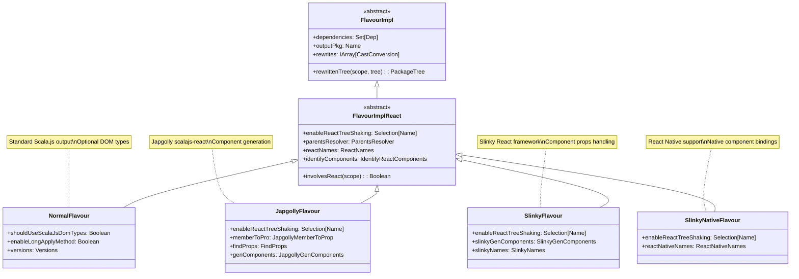

## 8. Performance and Optimization Strategies

### Caching and Performance Architecture

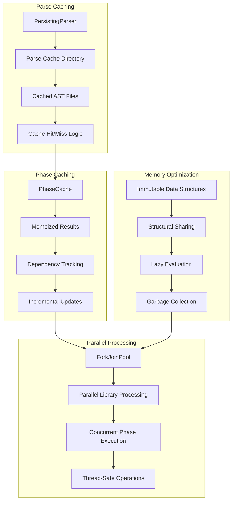

## 9. Error Handling and Resilience

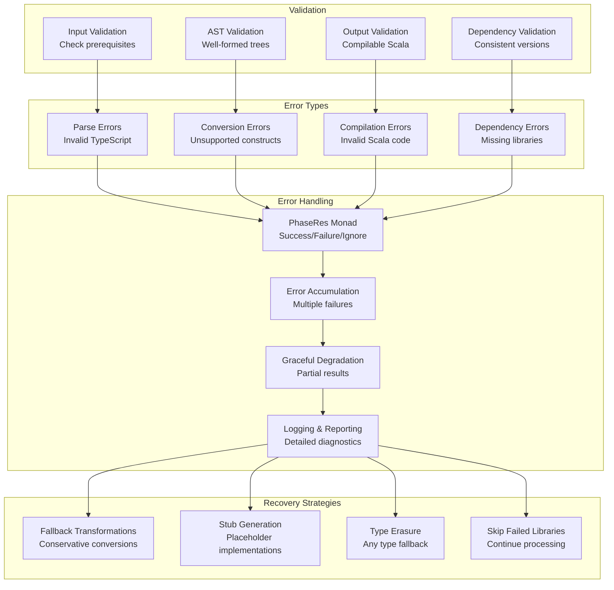

## 10. CLI Usage Patterns and Workflows

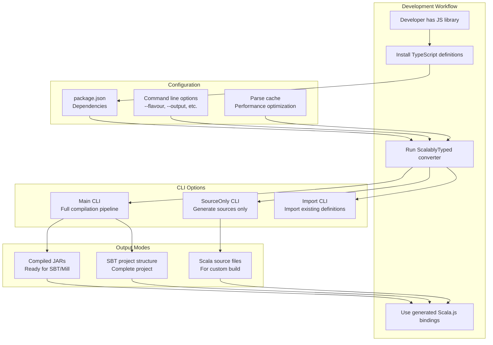

## 11. Key Design Decisions and Architectural Insights

### Important Design Decisions

1. **Immutable Data Structures**: The entire system uses immutable data structures (`IArray`, case classes) to ensure thread safety and enable safe parallel processing.

2. **Phase-based Pipeline**: The multi-phase approach allows for:
   - Clear separation of concerns
   - Dependency tracking between libraries
   - Incremental processing and caching
   - Error isolation and recovery

3. **Visitor Pattern for Transformations**: Both TypeScript and Scala.js ASTs use visitor patterns, enabling:
   - Composable transformations
   - Type-safe tree traversal
   - Reusable transformation logic

4. **Flavour System**: The strategy pattern for different output formats allows:
   - Support for multiple React frameworks
   - Customizable code generation
   - Framework-specific optimizations

## 12. Actionable Insights and Navigation Guide

### For New Developers

**Understanding the Codebase:**
1. **Start with Core Concepts**: Begin by examining the `core` module to understand fundamental data structures like `IArray`, `Name`, and `QualifiedName`
2. **Follow the Data Flow**: Trace a library through the pipeline by starting with `LibTsSource` → `LibTs` → `LibScalaJs` → `PublishedSbtProject`
3. **Study the Phase System**: Understand `RecPhase` and `PhaseRunner` in the `phases` module to grasp the execution model

**Key Entry Points for Code Exploration:**
- `cli/src/org/scalablytyped/converter/cli/Main.scala` - Main CLI entry point
- `importer-portable/src/org/scalablytyped/converter/internal/importer/Phase1ReadTypescript.scala` - TypeScript processing
- `importer-portable/src/org/scalablytyped/converter/internal/importer/Phase2ToScalaJs.scala` - Scala.js conversion
- `phases/src/org/scalablytyped/converter/internal/phases/RecPhase.scala` - Pipeline framework

### For Architecture Modifications

**Adding New Transformations:**
1. **TypeScript Transformations**: Add to `ts/transforms` package and include in `Phase1ReadTypescript.Pipeline`
2. **Scala.js Transformations**: Add to `scalajs/transforms` package and include in `Phase2ToScalaJs.ScalaTransforms`
3. **New Flavours**: Extend `FlavourImpl` or `FlavourImplReact` for custom output formats

**Extending the Pipeline:**
1. **New Phases**: Create new phase classes implementing `Phase[Id, T, TT]`
2. **Phase Integration**: Add to the pipeline using `.next()` method
3. **Dependency Management**: Ensure proper dependency resolution in `getDeps`

### For Performance Optimization

**Caching Strategies:**
1. **Parse Caching**: Leverage `PersistingParser` for expensive TypeScript parsing
2. **Phase Caching**: Use `PhaseCache` for memoizing transformation results
3. **Incremental Processing**: Implement dependency-aware incremental updates

**Parallel Processing:**
1. **Library-Level Parallelism**: Process independent libraries concurrently
2. **Phase-Level Parallelism**: Execute non-dependent phases in parallel
3. **Memory Management**: Monitor and optimize memory usage with large codebases

## 13. Common Use Cases and Examples

### Basic Usage Examples

**Generate Sources Only:**
```bash
mill cli.runMain org.scalablytyped.converter.cli.SourceOnlyMain -o ./my-sources
```

**Full Pipeline with React Support:**
```bash
mill cli.runMain org.scalablytyped.converter.cli.Main --flavour slinky --enableReactTreeShaking
```

**Import Existing Scala.js Definitions:**
```bash
mill cli.runMain org.scalablytyped.converter.cli.ImportScalajsDefinitions
```

### Configuration Patterns

**Custom Output Package:**
- Modify `outputPackage` in `ConversionOptions` to change the root package name
- Affects all generated Scala code organization

**Library-Specific Handling:**
- Add custom transformations in `LibrarySpecific` for problematic libraries
- Handle edge cases and library-specific quirks

**Dependency Management:**
- Configure `ignored` libraries to skip problematic dependencies
- Use `enableScalaJsDefined` to control @ScalaJSDefined annotation usage

## 14. Future Extension Points

### Planned Enhancements

**Type System Improvements:**
1. **Better Union Type Handling**: Enhanced conversion of TypeScript union types to Scala sealed traits
2. **Generic Constraints**: Improved handling of TypeScript generic constraints
3. **Conditional Types**: Support for TypeScript conditional types

**Performance Enhancements:**
1. **Streaming Processing**: Process large libraries without loading entire ASTs into memory
2. **Distributed Processing**: Support for distributed compilation across multiple machines
3. **Smart Caching**: Content-based caching with automatic invalidation

**Developer Experience:**
1. **IDE Integration**: Better IDE support with error highlighting and quick fixes
2. **Interactive Mode**: REPL-like interface for testing conversions
3. **Debugging Tools**: Visual AST inspection and transformation debugging

### Extension Architecture

The system is designed for extensibility through:

1. **Plugin System**: Add new phases and transformations without modifying core code
2. **Custom Flavours**: Create domain-specific output formats
3. **External Integrations**: Connect with other build tools and IDEs
4. **Configuration DSL**: Declarative configuration for complex conversion scenarios

## Conclusion

The Scalablytyped Converter represents a sophisticated piece of software engineering that bridges two complex type systems. Its architecture demonstrates several important principles:

- **Separation of Concerns**: Clear module boundaries with well-defined responsibilities
- **Immutability**: Thread-safe, predictable data structures throughout
- **Composability**: Transformations and phases can be combined and reused
- **Extensibility**: Plugin points for custom behavior and new features
- **Performance**: Caching and parallel processing for large-scale conversions

The multi-phase pipeline architecture, combined with the visitor pattern for transformations, creates a flexible and maintainable system that can handle the complexity of converting between TypeScript and Scala.js type systems while providing multiple output formats for different React frameworks.

For developers working with this codebase, understanding the phase system and data flow is crucial, while the extensive use of functional programming patterns and immutable data structures ensures that modifications can be made safely and predictably.
